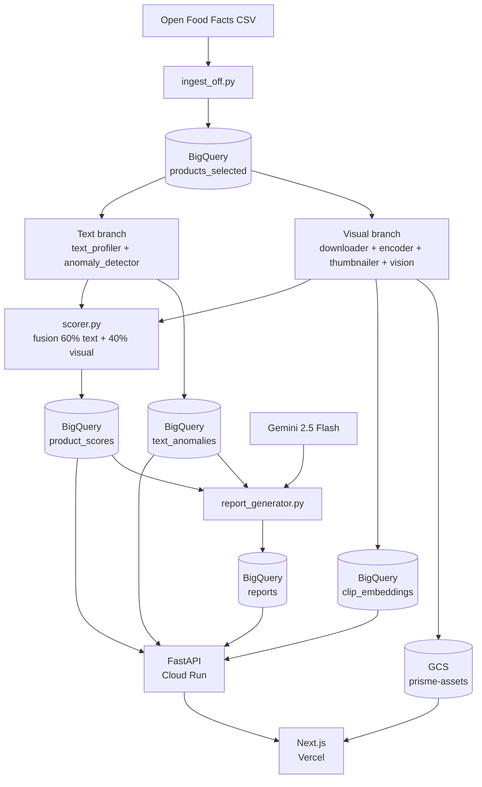
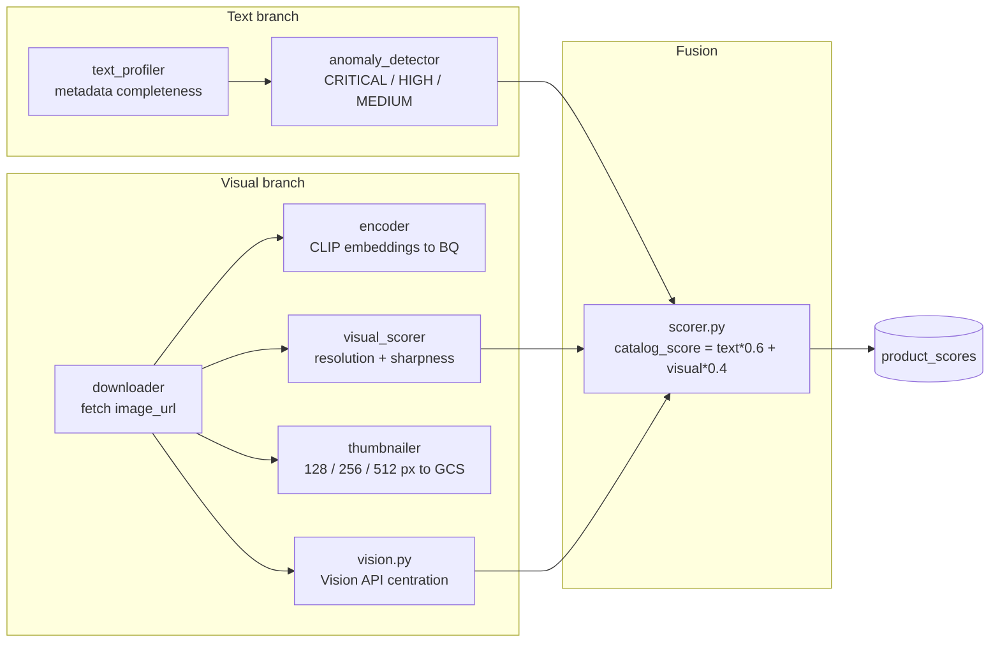
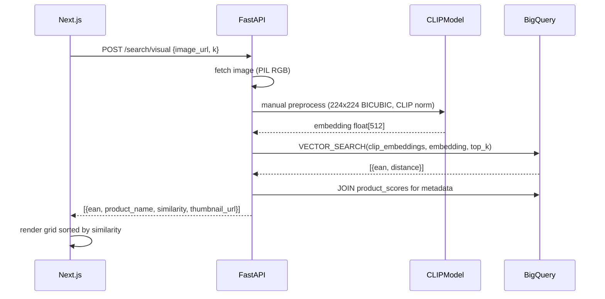

# Prisme

**Catalogue quality audit platform for FMCG / retail.**
Prisme ingests 1 000 Open Food Facts products, runs a dual-branch audit pipeline (text metadata + visual assets), exposes a REST API, and serves a Next.js dashboard with CLIP-powered visual search and daily Gemini AI reports.


**Live demo:** [prisme.stephanewamba.com](https://prisme.stephanewamba.com)

---

## Architecture



---

## Pipeline



---

## API endpoints

| Method | Path | Description |
|--------|------|-------------|
| GET | `/health` | Liveness check |
| GET | `/catalog/summary` | Global score averages |
| GET | `/catalog/evolution` | 30-day score history |
| GET | `/catalog/categories` | Category ranking |
| GET | `/products` | Paginated product list with filters |
| GET | `/products/{ean}` | Full product detail |
| GET | `/anomalies` | Detected anomalies (7 days) |
| GET | `/reports/latest` | Latest Gemini report |
| POST | `/search/visual` | CLIP visual similarity search |

---

## Visual search



---

## Scoring model

| Dimension | Weight | Sub-components |
|-----------|--------|----------------|
| Text score | 60% | Name, brands, categories, nutriscore, quantity, packaging completeness |
| Visual score | 40% | Resolution 40% + Sharpness 40% + Centration (Vision API) 20% |

`catalog_score = text_score * 0.6 + visual_score * 0.4`

---

## Tech stack

| Layer | Technology |
|-------|-----------|
| Frontend | Next.js 14, TypeScript, App Router, Vercel |
| API | FastAPI 0.111, Python 3.12, Cloud Run |
| Pipeline | Python, BigQuery ML, Cloud Build, Docker |
| AI / ML | CLIP (openai/clip-vit-base-patch32), Gemini 2.5 Flash, Vision API |
| Storage | BigQuery (scores, embeddings, reports), GCS (thumbnails) |
| Infra | GCP: Cloud Run, Cloud Build, Artifact Registry, Cloud Storage |

---

## Project structure

```
prisme/
├── api/                     # FastAPI service (Cloud Run)
│   ├── routers/             # catalog, products, anomalies, search, reports
│   ├── services/            # bigquery.py, clip.py, vertex.py
│   └── requirements.txt
├── pipeline/                # Daily audit pipeline (Cloud Build)
│   ├── encoder.py           # CLIP batch embedding to BQ
│   ├── scorer.py            # Fusion scoring
│   ├── report_generator.py  # Gemini AI daily report
│   └── ...
├── frontend/                # Next.js app (Vercel)
│   └── src/app/
│       ├── page.tsx         # Dashboard
│       ├── categories/      # Category ranking
│       ├── anomalies/       # Alert list
│       ├── products/        # Catalogue + product detail
│       ├── search/          # CLIP visual search
│       └── reports/         # Gemini AI reports
├── sql/                     # BigQuery table DDL + ARIMA views
├── infra/                   # BQ table creation, IAM, data loading
└── docker/                  # Dockerfile.api, Dockerfile.pipeline
```

---

## Setup

### Prerequisites

- GCP project with BigQuery, Cloud Run, Cloud Build, Vision API enabled
- Artifact Registry repository for Docker images
- Vercel account

### Environment variables

**Cloud Run (API)**

```
GOOGLE_APPLICATION_CREDENTIALS or Workload Identity
GEMINI_API_KEY
```

**Vercel (frontend)**

```
NEXT_PUBLIC_API_URL=https://<cloud-run-url>
```

### Deploy API

```bash
gcloud builds submit --config cloudbuild-api.yaml
gcloud run deploy prisme-api \
  --image europe-west1-docker.pkg.dev/<project>/prisme-docker/prisme-api:latest \
  --region europe-west1
```

### Deploy frontend

```bash
cd frontend && vercel --prod
```

### Run pipeline

```bash
docker build -f docker/Dockerfile.pipeline -t prisme-pipeline .
docker run --env-file .env prisme-pipeline
```
