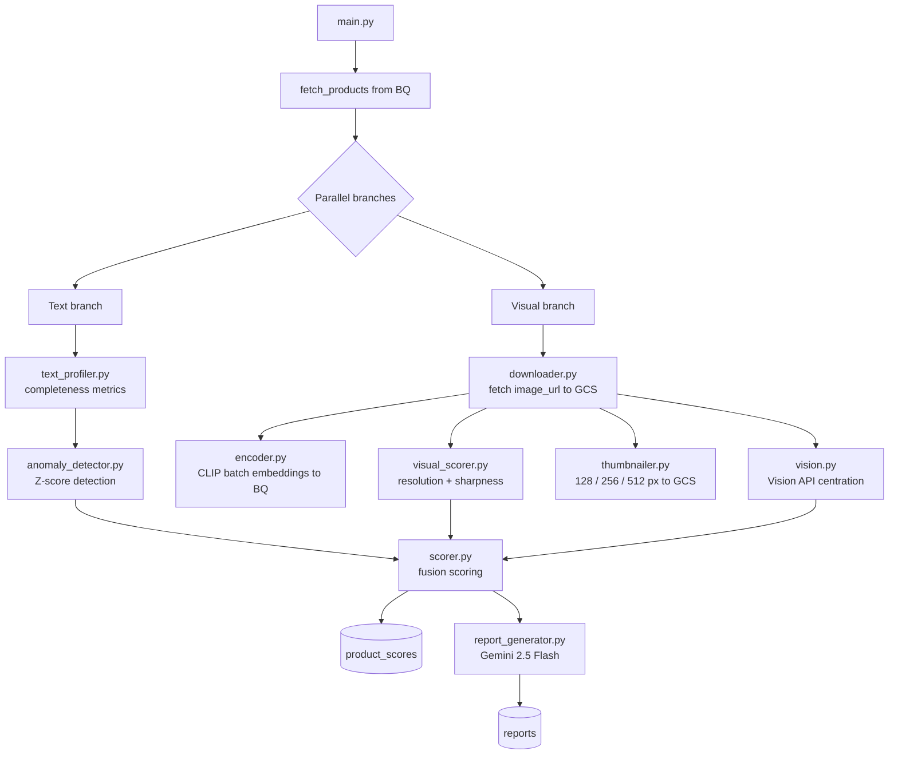

# Pipeline

The Prisme pipeline is a daily batch job that ingests 1 000 Open Food Facts products, runs a dual-branch audit (text + visual), fuses scores, and generates a Gemini AI report.

---

## Execution flow



---

## Modules

### main.py

Orchestrator. Calls text and visual branches concurrently via `ThreadPoolExecutor`, then calls `scorer.py` with merged results.

```python
# Rough execution order
products = fetch_products()          # SELECT 1000 from BQ
text_metrics, anomalies = text_branch(products, run_id, run_date)
dl_results, visual_scores, vision_results, thumbs = visual_branch(products, run_id, run_date)
scorer.update_scores(...)
report_generator.run(run_id, run_date)
```

---

### text_profiler.py

Computes completeness metrics for each metadata field.

**Tracked fields and weights**

| Field | Weight |
|-------|--------|
| `product_name` | 30 |
| `brands` | 15 |
| `categories` | 20 |
| `ingredients_text` | 20 |
| `nutriscore_grade` | 10 |
| `quantity` | 3 |
| `packaging` | 2 |

Also checks coherence: products that have `ingredients_text` but no `nutriscore_grade`.

Output written to BQ table `text_metrics`.

---

### anomaly_detector.py

Detects anomalies by comparing current metrics against 30-day history using Z-scores.

**Algorithm**

```
For each metric:
  1. Fetch last 30 daily values from BQ (excluding current run)
  2. Compute mean and stdev
  3. Z = (current_value - mean) / stdev
  4. If |Z| > 2.5: flag as anomaly
```

**Severity thresholds**

| Z-score | Severity |
|---------|----------|
| > 4.0 | CRITICAL |
| > 3.0 | HIGH |
| > 2.5 | MEDIUM |
| else | LOW |

Output written to BQ table `text_anomalies`.

---

### downloader.py

Downloads `image_url` for each product from Open Food Facts and writes originals to GCS at `gs://prisme-assets/originals/{ean}.jpg`.

Records success/failure per EAN. Failed downloads result in `visual_score = 0`.

---

### encoder.py

Encodes product images with CLIP (`openai/clip-vit-base-patch32`) in batches and writes 512-dimensional embeddings to BQ table `clip_embeddings`.

**Batch processing**

- Default batch size: 32 images
- Checkpoints every N batches to BQ (resume-safe)
- Memory cleared between batches (`gc.collect()`)

The embeddings enable cosine similarity search via `BigQuery.VECTOR_SEARCH`.

---

### visual_scorer.py

Computes two sub-scores from raw image analysis:

| Sub-score | Method | Description |
|-----------|--------|-------------|
| `resolution_score` | PIL image size | Width x height normalized to 0-100 |
| `sharpness_score` | Laplacian variance | Variance of Laplacian (blur detection) normalized |

---

### thumbnailer.py

Generates product thumbnails at 3 sizes and uploads them to GCS.

| Size | GCS path |
|------|----------|
| 128px | `gs://prisme-assets/thumbnails/128/{ean}.jpg` |
| 256px | `gs://prisme-assets/thumbnails/256/{ean}.jpg` |
| 512px | `gs://prisme-assets/thumbnails/512/{ean}.jpg` |

The bucket `prisme-assets` is public (`allUsers objectViewer`). Thumbnail URLs are stored in `product_scores`.

---

### vision.py

Calls Google Cloud Vision API on each product image to detect the primary object label and compute a centration score (how centered the main subject is in the frame).

Output stored in BQ table `visual_detections`.

| Field | Description |
|-------|-------------|
| `primary_object_label` | Top Vision API label (e.g. "soup", "chocolate") |
| `centration_score` | 0-100, based on bounding box proximity to center |

---

### scorer.py

Fuses text and visual scores into a single `catalog_score`.

```
visual_score = resolution * 0.4 + sharpness * 0.4 + centration * 0.2
catalog_score = text_score * 0.6 + visual_score * 0.4
```

All values are clamped to `[0, 100]`. Output written to BQ table `product_scores`.

---

### report_generator.py

Generates a daily AI report using Gemini 2.5 Flash.

**Prompt inputs (fetched from BQ)**
- Global score averages for the latest run
- Top 10 anomalies from last 24h sorted by severity
- 5 worst-performing categories

**Output format (JSON)**
```json
{
  "executive_summary": "...",
  "catalog_score": 62,
  "text_score": 62,
  "visual_score": 61,
  "critical_issues": ["..."],
  "worst_categories": ["..."],
  "recommendations": ["..."]
}
```

Written to BQ table `reports`. The API exposes it via `GET /reports/latest`.

---

## Running locally

```bash
cd pipeline
pip install -r requirements.txt
export GOOGLE_APPLICATION_CREDENTIALS=/path/to/sa-key.json
python main.py
```

## Running via Docker

```bash
docker build -f docker/Dockerfile.pipeline -t prisme-pipeline .
docker run \
  -e GOOGLE_APPLICATION_CREDENTIALS=/sa.json \
  -v /path/to/sa.json:/sa.json \
  prisme-pipeline
```
